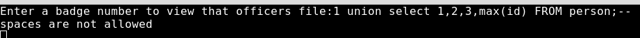

<!DOCTYPE html  PUBLIC '-//W3C//DTD XHTML 1.0 Transitional//EN'  'http://www.w3.org/TR/xhtml1/DTD/xhtml1-transitional.dtd'><html xmlns="http://www.w3.org/1999/xhtml">
<head>
<meta content="text/html; charset=utf-8" http-equiv="Content-Type"/>
</head><body>SQL-25 
https://sql-mayham.openctf.com/iouwoiuzxoipuzxciovpuuiopxvziooqlaoupsa/sql-25/ 
 
Lets start by entering the same query from SQL-10 
1 union select 1,2,3,max(id) FROM person;-- 
 
 
Hmm. Spaces aren't allowed. One way you can get away with spaces, but not actually put spaces is the comment command. There are two types, line and block. We don't want to comment the rest of the line so we need the block comment (/** comment goes here to include new line **/). Lets try it. 
1/****/union/****/select/****/1,2,3,max(id)/****/FROM/****/person;-- 
 
 
Sweet, now lets try this one. 
 
Now we have another flag!</body></html>